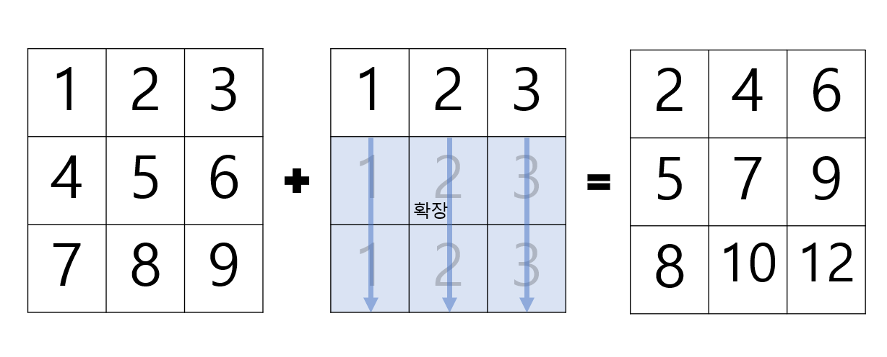

---
## 1. Broadcasting

두 행렬을 더할 때, 만약 서로 차원이 다르다면 더하는게 불가능해진다. 예를 들어, 1차원인 행렬과 2차원의 행렬의 덧셈은 불가능하다. 하지만 numpy의 브로드캐스팅을 이용하게 되면 차원이 다른 행렬도 확장기능을 이용하여 덧셈이 가능해진다.




```python
import numpy as np

arr = np.arange(1, 10).reshape(3, 3)
arr2 = np.arange(1, 4).reshape(1, 3)
print(arr)
print(arr2)
```
    >>> [[1 2 3]
         [4 5 6]
         [7 8 9]]
    >>> [[1 2 3]]

```python
print(arr + arr2)
```

    >>> [[2 4 6]
         [5 7 9]
         [8 10 12]]

<br>
