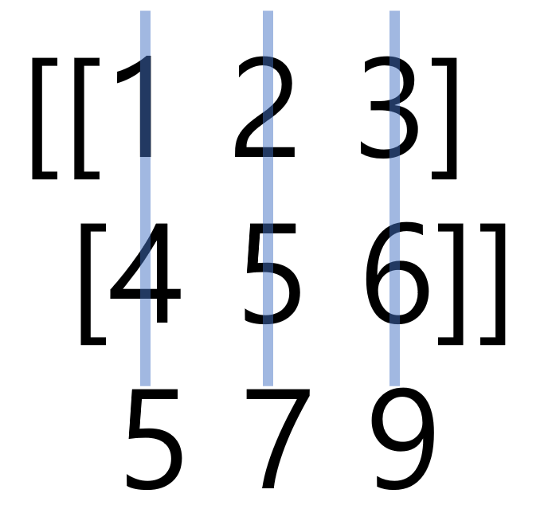

---
## 1. axis()

해당 데이터들이 연산될 때 axis를 기준으로 연산이 된다. 이 값을 주지않을 경우 default 값으로는 none이 들어가게 되어 모든 값들 더하여 출력한다. 또한, axis 값은 (차원 - 1)까지 설정할 수 있다.

* #### 1차원

##### default

```python
import numpy as np

arr = np.arange(1, 6)
print(arr)
print(np.sum(arr))
```
    >>> [1 2 3 4 5]
    >>> 15

<br>

##### axis = 0

```python
import numpy as np

arr = np.arange(1, 6)
print(arr)
print(np.sum(arr))
```
    >>> [1 2 3 4 5]
    >>> 15

<br>

* #### 2차원

##### default

```python
import numpy as np

arr = np.arange(1, 7).reshape(2, 3)
print(arr)
print(np.sum(arr))
```
    >>> [[1 2 3]
        [4 5 6]]
    >>> 21

<br>

##### axis = 0

axis가 0 이고 2 x 3 행렬에서의 출력값은 2행이 지워진 3열이 나오게 된다.



```python
import numpy as np

arr = np.arange(1, 7).reshape(2, 3)
print(arr)
print(np.sum(arr, axis=0))
```
    >>> [[1 2 3]
        [4 5 6]]
    >>> [5 7 9]

#### axis = 1

axis가 1 이고 2 x 3 행렬에서의 출력값은 3열이 지워진 2열이 나오게 된다.

```python
import numpy as np

arr = np.arange(1, 7).reshape(2, 3)
print(arr)
print(np.sum(arr, axis=1))
```
    >>> [[1 2 3]
        [4 5 6]]
    >>> [6 15]